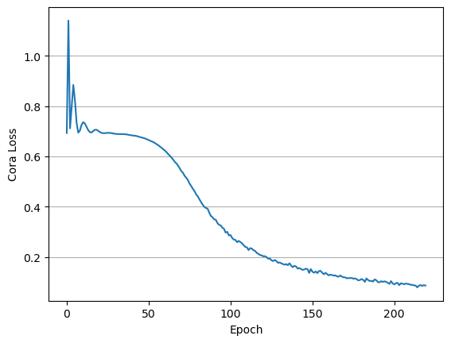
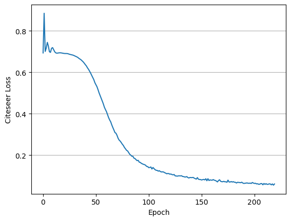
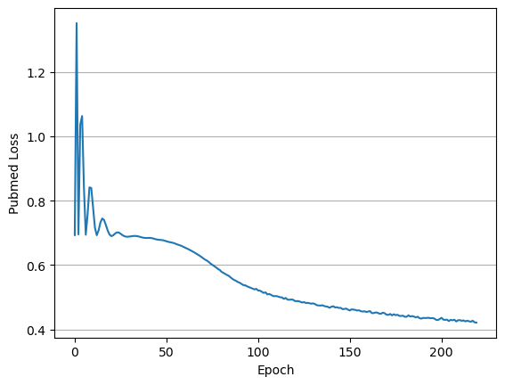
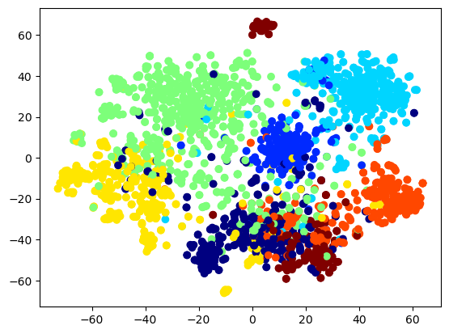
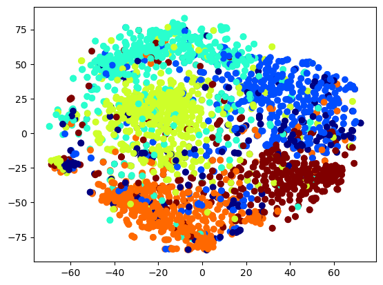
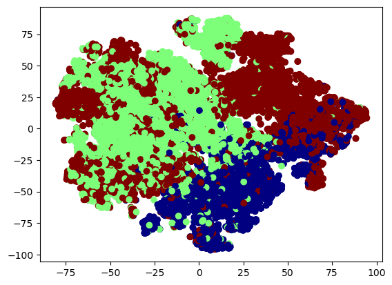

# Deep Graph Infomax

## Paper 
[Deep Graph Infomax](https://arxiv.org/abs/1809.10341)

## Review
[Review](https://velog.io/@sangwu99/Deep-Graph-Infomax-ICLR-2019)

## Implementation 
    
```
# you can choose dataset in Cora, Citeseer, Pubmed
python main.py --dataset_name Cora
```

## Result




---





---

| Dataset | Acc | Macro F1 | 
| :---: | --- | --- |
| Cora | 0.85 | 0.80 |
| Citeseer | 0.73 | 0.63 |
| Pubmed | 0.85 | 0.85 |