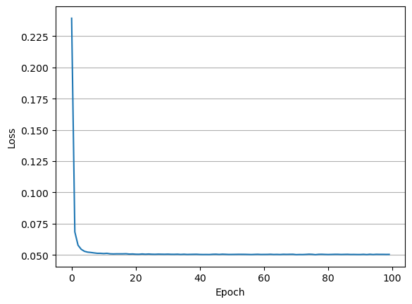

# TransE 

## Paper 
[Translating Embeddings for Modeling Multi-relational Data](https://papers.nips.cc/paper_files/paper/2013/file/1cecc7a77928ca8133fa24680a88d2f9-Paper.pdf)

## Implementation 
    
```
python main.py --embedding_dim 50 --margin 1.0 --use_gpu True --epochs 100 --neg_num 2 --batch_size 512 --lr 0.005
```

## Result
