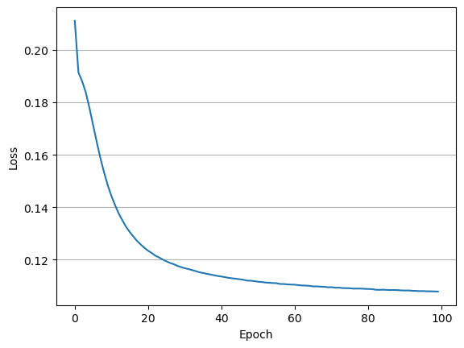

# FM

## Paper 
[Factorization Machines](https://www.csie.ntu.edu.tw/~b97053/paper/Rendle2010FM.pdf)

## Review
[Review](https://velog.io/@sangwu99/Factorization-Machine-IEEE-2010)

## Implementation 
    
```
python main.py --epochs 100 --batch_size 64 --lr 0.001 --factor_dim 10
```

## Result
