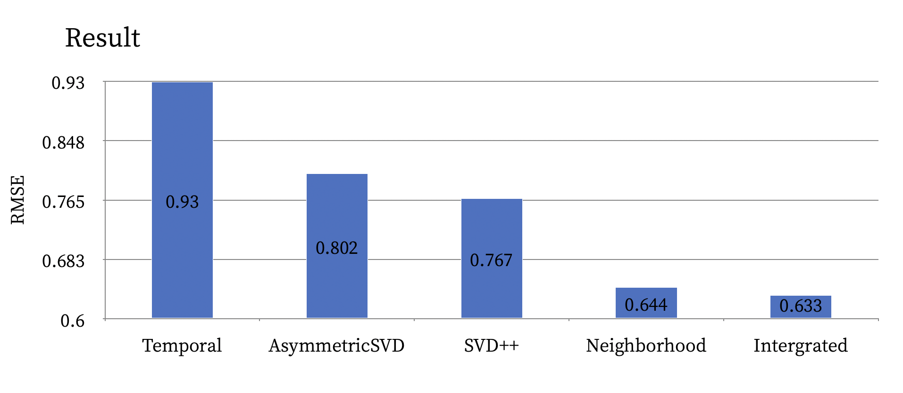

## Paper 
[Matrix Factorization Techniques for Recommender Systems](https://datajobs.com/data-science-repo/Recommender-Systems-%5BNetflix%5D.pdf)

[Factorization Meets the Neighborhood: a Multifaceted Collaborative Filtering Model](https://dl.acm.org/doi/10.1145/1401890.1401944)

## Review 
[Matrix Factorization Techniques for Recommender Systems](https://velog.io/@sangwu99/Matrix-Factorization-Techniques-for-Recommender-Systems-IEEE-2009)

[Factorization Meets the Neighborhood: a Multifaceted Collaborative Filtering Model](https://velog.io/@sangwu99/Factorization-Meets-the-Neighborhood-a-Multifaceted-Collaborative-Filtering-Model-KDD-2008)

## Implementation 
[Implementation](./Netflix.ipynb)

```python
python main.py --preprocess True 
```



## Reference 

https://greeksharifa.github.io/machine_learning/2019/12/20/Matrix-Factorization/

https://soobarkbar.tistory.com/105

https://supkoon.tistory.com/30

https://velog.io/@tobigs-recsys/MATRIX-FACTORIZATION-TECHNIQUES-FOR-RECOMMENDER-SYSTEM

https://velog.io/@tobigs-recsys/Paper-Review-KDD-2008-Factorization-meets-the-neighborhood-a-multifaceted-collaborative-filtering-model

https://sukwonyun.github.io/blog/2021/Netflix2/

https://steady-programming.tistory.com/44

https://www.shalomeir.com/2014/11/netflix-prize-1/