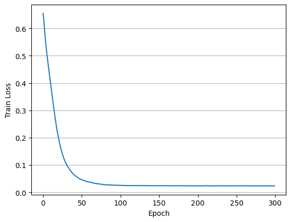
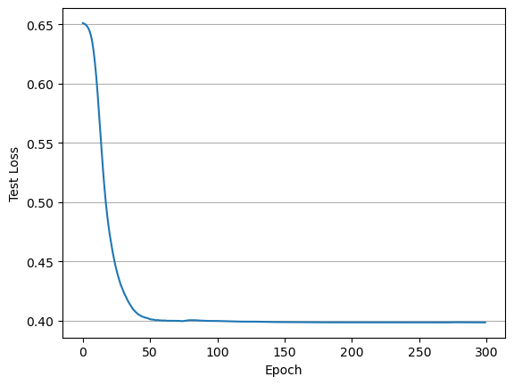
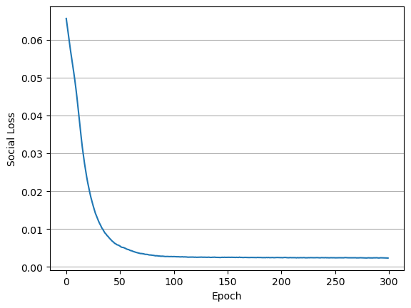

# SoRec

## Paper 
[SoRec: Social Recommendation Using Probabilistic Matrix Factorization](https://dl.acm.org/doi/10.1145/1458082.1458205)

## Data
[Epinions](https://www.kaggle.com/datasets/masoud3/epinions-trust-network?resource=download)

## Implementation 
    
```
python main.py --user_num 5000 --item_num 5000 --num_factors 32 --lr 0.001 --batch_size 512 --lambda_c 0.1 --epochs 100 
```

## Result


