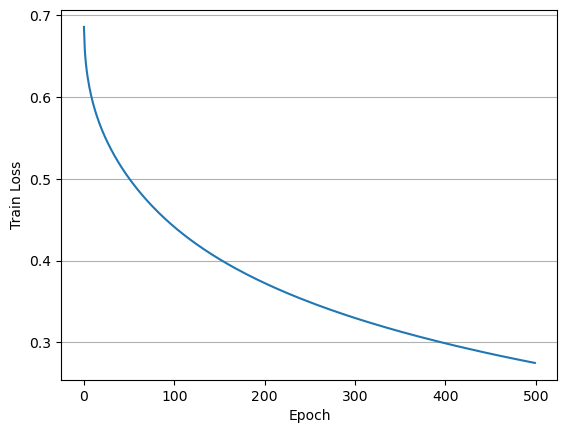

# Wide & Deep

## Paper 
[Wide & Deep Learning for Recommender Systems](https://arxiv.org/abs/1606.07792)

## Review
[Review](https://velog.io/@sangwu99/Wide-Deep-Learning-for-Recommender-Systems-2016-DLRS)

## Implementation 
    
```
python main.py --factor_dim 16 --layer_num 3 --hidden_dim [8, 4, 2] --output_dim 1
```

## Result

